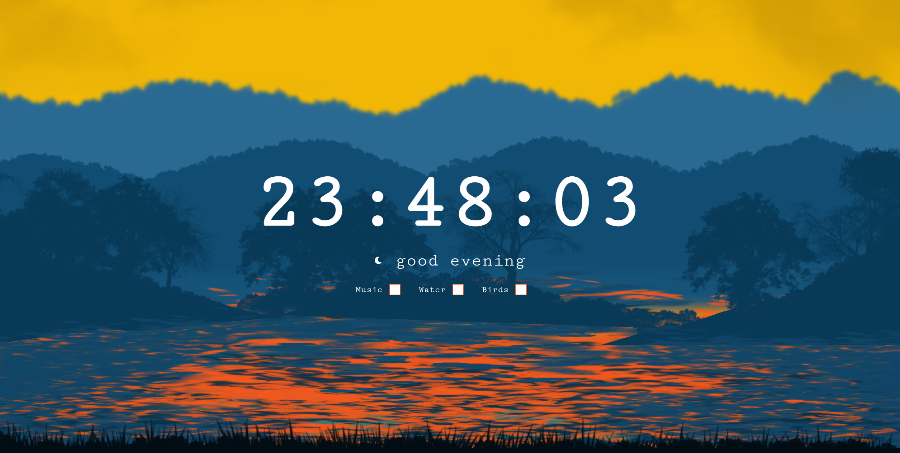

# Ambience - relax page

This is a project for the 4nd day of 100 days challenge. I wanted to make something pretty but simple.

## Table of contents

- [Overview](#overview)
  - [Screenshot](#screenshot)
  - [Links](#links)
- [My process](#my-process)
  - [Built with](#built-with)
- [Author](#author)
- [Attribution](#Attribution)

## Overview

### Day 4 of 100 days challenge

I might have a problem with making decisions. In the beginning I wanted to make a coffee shop ambience. I gave up after 1 hour of trying to find the perfect background. Then I thought about a medieval tavern ambience - Skyrin/Witcher type - unfortunately, I couldn't find any good background. I realized that I should try to learn how to make a pixel art - I should add it to my "to-do list". Finally I found this parallax setup. I wanted to do something with paralax for quite some time so I found some youtube videos and started coding.

### Screenshot

### Links

- Solution URL: [here](https://github.com/joaskr/100-days-challenge/tree/main/Ambience)
- Live Site URL: [here](https://100-days-challenge-azure.vercel.app/Ambience/index.html)

## My process

### Built with

- Parallax.js

## Author

- Website - [Add your name here](https://www.your-site.com)
- Frontend Mentor - [@joaskr](https://www.frontendmentor.io/profile/joaskr)

## Attribution

- Background - [The Island: Parallax Ready 2D Background for Platformer or Side-Scroller by saukgp](https://saurabhkgp.itch.io/the-island-parallax-background-platformer-side-scroller)
- Music - [Free Ambient Music by Mayra](https://mayragandra.itch.io/freeambientmusic)
- Water sounds - [Water lapping on lake Pukaki,South Island,New Zealand by laughatlantic](https://freesound.org/people/laughatlantic/sounds/528067/)
- Birds sounds - [Birds In Spring (Scotland) by BurghRecords](https://freesound.org/people/BurghRecords/sounds/463903/)
- Youtube tutorial for parallax.js - [Awesome Background Parallax Effect on Mousemove by OnlineTutorials](https://www.youtube.com/watch?v=6xVMUo0_hu4)
