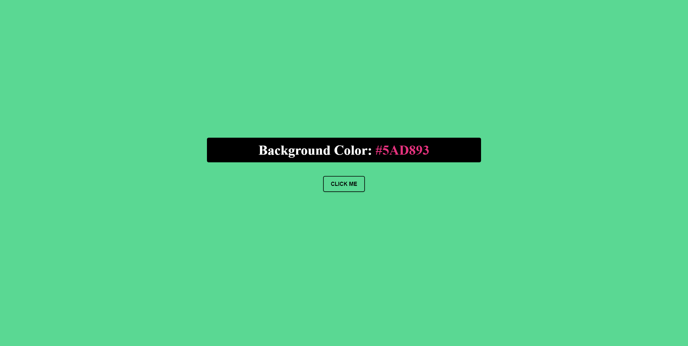

# Color switch

I was working on another project when I realized that it was a little bit to big to finish it on time. So I did this instead.

## Table of contents

- [Overview](#overview)
  - [Screenshot](#screenshot)
  - [Links](#links)
- [My process](#my-process)
  - [Built with](#built-with)
- [Author](#author)

## Overview

### Day 5 of 100 days challenge

I just like pretty colors... I did something similar 2 years ago and wanted to build it again and that's it.

### Screenshot

### Links

- Solution URL: [here](https://github.com/joaskr/100-days-challenge/tree/main/Color-switch)
- Live Site URL: [here](https://100-days-challenge-azure.vercel.app/Color-switch/index.html)

## My process

### Built with

- Semantic HTML5 markup
- CSS
- Vanilla JS

## Author

- Website - [Add your name here](https://www.your-site.com)
- Frontend Mentor - [@joaskr](https://www.frontendmentor.io/profile/joaskr)
