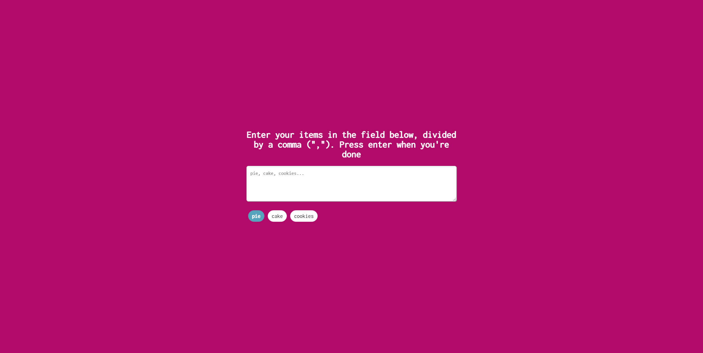

# Get random

Do you have problems with making decisions? Try the random picker and let the fate decide.

## Table of contents

- [Overview](#overview)
  - [Screenshot](#screenshot)
  - [Links](#links)
- [My process](#my-process)
  - [Built with](#built-with)
- [Author](#author)

## Overview

### Day 12 of 100 days challenge

This project is inspired by Brad Traversy course - 50 projects 50 days - I tried to rebuild it from memory.

### Screenshot

### Links

- Solution URL: [here](https://github.com/joaskr/100-days-challenge/tree/main/Picker)
- Live Site URL: [here](https://100-days-challenge-azure.vercel.app/Picker/index.html)

## My process

### Built with

- HTML
- CSS
- JS

## Author

- Website - [Add your name here](https://www.your-site.com)
- Frontend Mentor - [@joaskr](https://www.frontendmentor.io/profile/joaskr)
