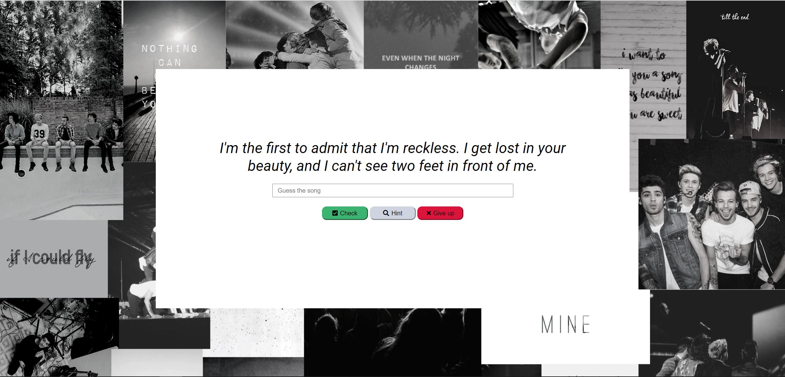

# One Direction song quiz

This is a project for the 2nd day of 100 days challenge. Test your knowledge of One Direction songs and see if you are a true directioner. Press "check" to see if you were correct, use "hint" for a small hint and "give up" if you have no idea.

## Table of contents

- [Overview](#overview)
  - [Screenshot](#screenshot)
  - [Links](#links)
- [My process](#my-process)
  - [Built with](#built-with)
- [Author](#author)

## Overview

### Day 2 of 100 days challenge

This challenge took me longer than I expected but I had so much fun doing it! I refreshed API calls and basic DOM modification and I created my own rest API with Node js, Express and Heroku.
### Screenshot

### Links

- Solution URL: [here](https://github.com/joaskr/100-days-challenge/tree/main/Guess-song)
- Live Site URL: [here](https://100-days-challenge-azure.vercel.app/Guess-song/index.html)

## My process

### Built with

- Semantic HTML5 markup
- CSS
- Flexbox
- Async, await
- API created with node js and express, hosted on Heroku
- Passion and weird high school obsession

## Author

- Website - [Add your name here](https://www.your-site.com)
- Frontend Mentor - [@joaskr](https://www.frontendmentor.io/profile/joaskr)
