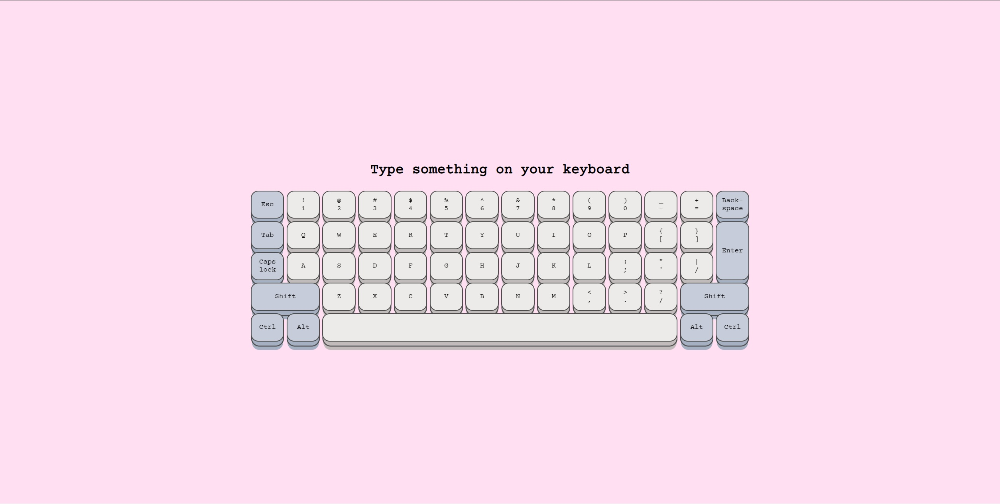

# One Direction song quiz

Today is 7th day of the challenge. I was running low on creativity today but during lunch I came up with the idea of a virtual keyboard because why not.

## Table of contents

- [Overview](#overview)
  - [Screenshot](#screenshot)
  - [Links](#links)
- [My process](#my-process)
  - [Built with](#built-with)
- [Author](#author)

## Overview

### Day 7 of 100 days challenge

I had some challenges - initially with grid planning and later with assigning keyboard events to correct buttons. There are some issues with local keyboards but it works mostly okay. Also, since this is a project for computers I added special screen for small devices.

### Screenshot

### Links

- Solution URL: [here](https://github.com/joaskr/100-days-challenge/tree/main/Keyboard)
- Live Site URL: [here](https://100-days-challenge-azure.vercel.app/Keyboard/index.html)

## My process

### Built with

- Grid
- This codepen helped me with button design - [3D Button by Katherine Kato](https://codepen.io/kathykato/pen/gOOjgmP)
- And the style of the project was inspired by - [Pure CSS Happy Hacking Keyboard by Peiwen Lu](https://codepen.io/P233/pen/qEagi)
- Keyboard sound - [Pressing the enter button by ilip33](https://freesound.org/people/ilip33/sounds/593237/)

## Author

- Website - [Add your name here](https://www.your-site.com)
- Frontend Mentor - [@joaskr](https://www.frontendmentor.io/profile/joaskr)
