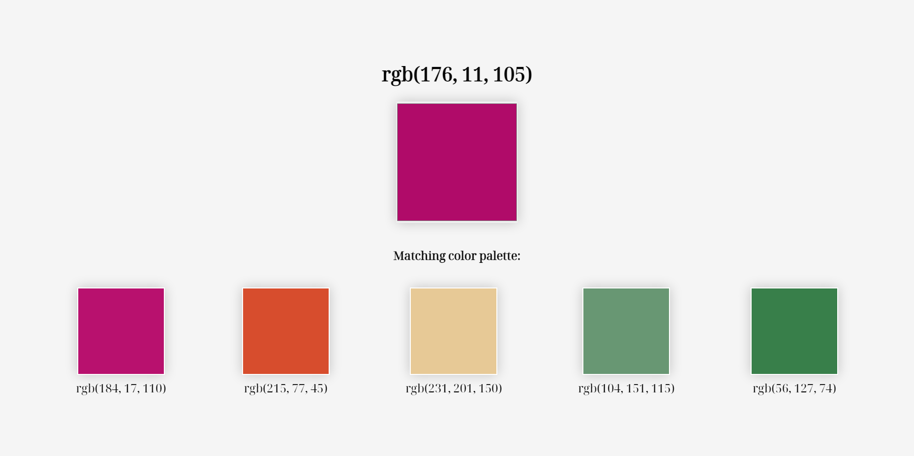

# Color picker

Pick a color and see a matching color palette. Boom, it's magic. Colors are pretty. Well, most of them.

## Table of contents

- [Overview](#overview)
  - [Screenshot](#screenshot)
  - [Links](#links)
- [My process](#my-process)
  - [Built with](#built-with)
- [Author](#author)

## Overview

### Day 11 of 100 days challenge

I found an API. I used it. There's not much behind this project. It was fun to make and I think I have some ides how to improve it in the future.

### Screenshot

### Links

- Solution URL: [here](https://github.com/joaskr/100-days-challenge/tree/main/Picker)
- Live Site URL: [here](https://100-days-challenge-azure.vercel.app/Picker/index.html)

## My process

### Built with

- HTML
- CSS
- JS
- [Colormind API](http://colormind.io/api-access/)

## Author

- Website - [Add your name here](https://www.your-site.com)
- Frontend Mentor - [@joaskr](https://www.frontendmentor.io/profile/joaskr)
