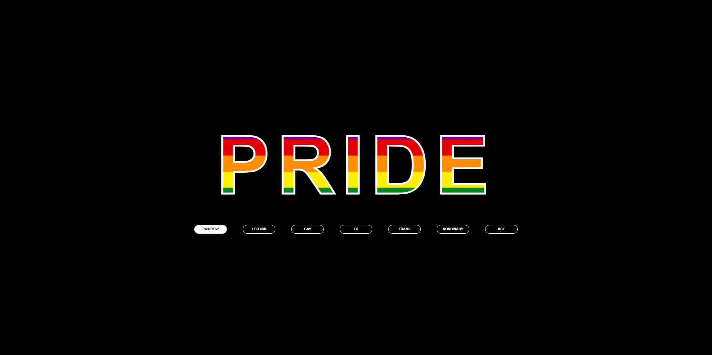

# Pride

Every day is a great day to be proud. As a member of the LQBTQ+ community I wanted to make a small project celebrating that. It's small but it made me happy.

## Table of contents

- [Overview](#overview)
  - [Screenshot](#screenshot)
  - [Links](#links)
- [My process](#my-process)
  - [Built with](#built-with)
- [Author](#author)

## Overview

### Day 10 of 100 days challenge

There wasn't anything particullary challenging in this project. I had some fun with colors and gradients.

### Screenshot

### Links

- Solution URL: [here](https://github.com/joaskr/100-days-challenge/tree/main/Pride)
- Live Site URL: [here](https://100-days-challenge-azure.vercel.app/Pride/index.html)

## My process

### Built with

- HTML
- CSS
- Vanilla JS

## Author

- Website - [Add your name here](https://www.your-site.com)
- Frontend Mentor - [@joaskr](https://www.frontendmentor.io/profile/joaskr)
