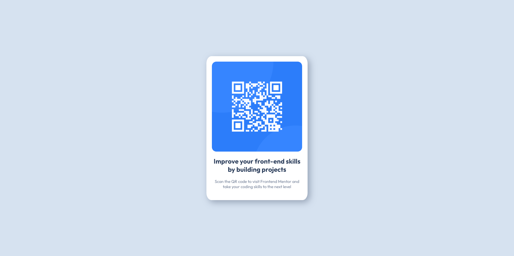

# Frontend Mentor - QR code component solution

This is a solution to the [QR code component challenge on Frontend Mentor](https://www.frontendmentor.io/challenges/qr-code-component-iux_sIO_H). Frontend Mentor challenges help you improve your coding skills by building realistic projects.

## Table of contents

- [Overview](#overview)
  - [Screenshot](#screenshot)
  - [Links](#links)
- [My process](#my-process)
  - [Built with](#built-with)
- [Author](#author)

## Overview

### Day 1 of 100 days challenge

During the first day I wanted to start with something easy but satisfying. That's why I chose a frontend mentor challenge. A simple HTML & CSS page is a good way to start a challenge and I can proudly say that I didn't have to google "how to center a div". That's an acomplishment.

### Screenshot

### Links

- Solution URL: [here](https://github.com/joaskr/100-days-challenge/tree/main/QR-code-component)
- Live Site URL: [here](https://100-days-challenge-azure.vercel.app/QR-code-component/index.html)

## My process

### Built with

- Semantic HTML5 markup
- CSS
- Flexbox

## Author

- Website - [Add your name here](https://www.your-site.com)
- Frontend Mentor - [@joaskr](https://www.frontendmentor.io/profile/joaskr)
