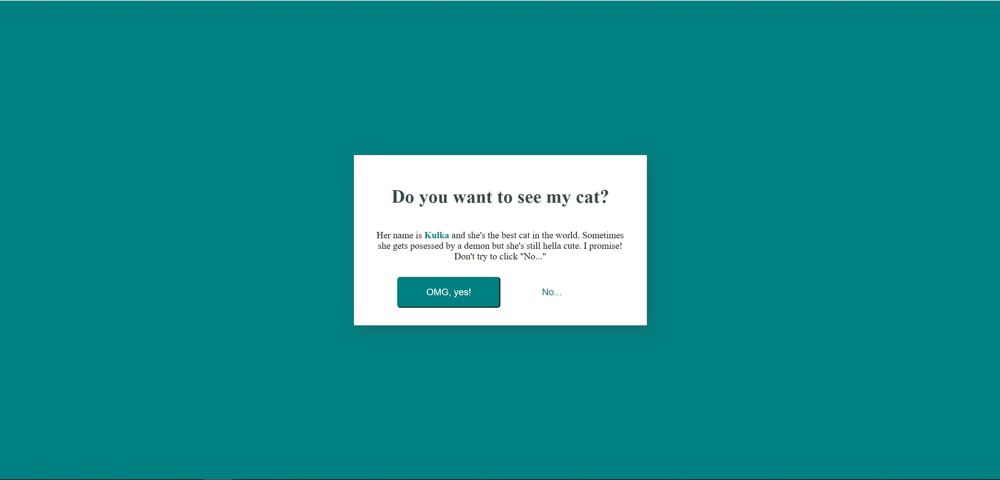

# Frontend Mentor - QR code component solution

This is a small website to show my awesome cat. There is a small trick but you hopefully won't find it. Just don't click on no...

## Table of contents

- [Overview](#overview)
  - [Screenshot](#screenshot)
  - [Links](#links)
- [My process](#my-process)
  - [Built with](#built-with)
- [Author](#author)

## Overview

### Day 3 of 100 days challenge

Today I decided to do something smaller. A couple of months ago I saw a project where it was impossible to resist cookies so I decided to do something similar but add a little bit of meow. I just really love my cat.

### Screenshot

### Links

- Solution URL: [here](https://github.com/joaskr/100-days-challenge/tree/main/Tricky-button)
- Live Site URL: [here](https://100-days-challenge-azure.vercel.app/Tricky-button/index.html)

## My process

### Built with

- Semantic HTML5 markup
- CSS
- Flexbox

## Author

- Website - [Add your name here](https://www.your-site.com)
- Frontend Mentor - [@joaskr](https://www.frontendmentor.io/profile/joaskr)
