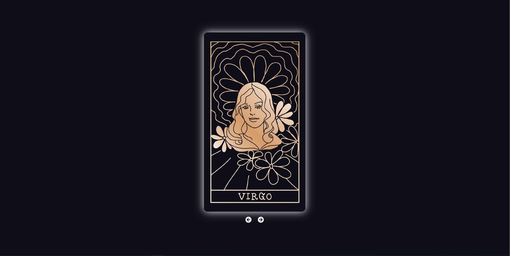

# Zodiac cards

There is an awesome word in polish - "zodiakara". It's a girl who is interested in astrology, knows everything about signs and will tell you everything about you after you tell her you sun, moon and rising sign. Even if you aren't a zodiakara a small guidance from universe might be helpful. Flip a card to see what's stars planned for you today.

## Table of contents

- [Overview](#overview)
  - [Screenshot](#screenshot)
  - [Links](#links)
- [My process](#my-process)
  - [Built with](#built-with)
- [Author](#author)

## Overview

### Day 6 of 100 days challenge

I feel like this project needs some improvements. I want to improve the API calls - i don't like the way it's done and replace card images with nicer ones. But let's leave that for later...

### Screenshot

### Links

- Solution URL: [here](https://github.com/joaskr/100-days-challenge/tree/main/Zodiac-cards)
- Live Site URL: [here](https://100-days-challenge-azure.vercel.app/Zodiac-cards/index.html)

## My process

### Built with

- API - [Aztro](https://aztro.readthedocs.io/en/latest/)
- Images - [Aesthetic zodiac signs](https://image.freepik.com/free-vector/aesthetic-zodiac-signs-doodle-art-collection-vector_53876-157867.jpg)

## Author

- Website - [Add your name here](https://www.your-site.com)
- Frontend Mentor - [@joaskr](https://www.frontendmentor.io/profile/joaskr)
