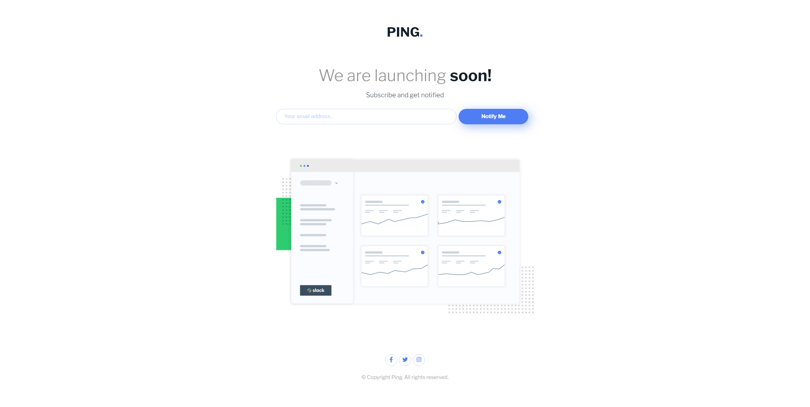

# Frontend Mentor - Ping coming soon page

This is a solution to the [Ping coming soon page challenge on Frontend Mentor](https://www.frontendmentor.io/challenges/ping-single-column-coming-soon-page-5cadd051fec04111f7b848da). Frontend Mentor challenges help you improve your coding skills by building realistic projects.

## Table of contents

- [Overview](#overview)
  - [Screenshot](#screenshot)
  - [Links](#links)
- [My process](#my-process)
  - [Built with](#built-with)
- [Author](#author)

## Overview

### Day 8 of 100 days challenge

The second week surprised me with it's intensity and magically I got delayed with projects from day 8, 9 and 10. I guess I need to find a little while to finish them.
This one was more challenging than I expected, probably because I was too tired to write without making typos but I finally finished it. Well, I'll probably fix it multiple times after I push it but at least it's done.

### Screenshot

### Links

- Solution URL: [here](https://github.com/joaskr/100-days-challenge/tree/main/ping-coming-soon-page)
- Live Site URL: [here](https://100-days-challenge-azure.vercel.app/ping-coming-soon-page/index.html)

## My process

### Built with

- Semantic HTML5 markup
- CSS
- Flexbox

## Author

- Website - [Add your name here](https://www.your-site.com)
- Frontend Mentor - [@joaskr](https://www.frontendmentor.io/profile/joaskr)
